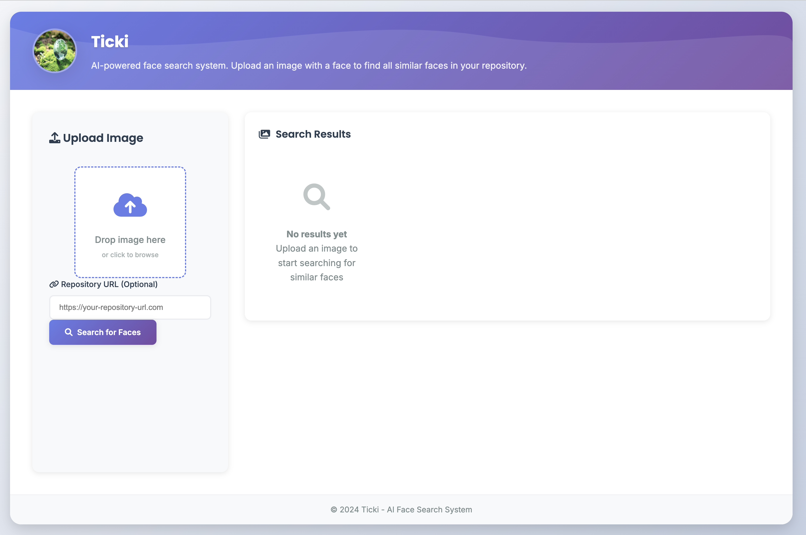

# Ticki - AI-Powered Face Search System

Ticki is a highly optimized content-based image retrieval (CBIR) system designed for lightning-fast face search across large image repositories. Built with cutting-edge computer vision and deep learning technologies, Ticki delivers enterprise-grade performance with advanced security features and multi-worker parallel processing capabilities.



## 🚀 Key Features

### Core Capabilities
- **Advanced Face Detection**: RetinaFace-powered face detection with alignment and area expansion
- **Deep Learning Embeddings**: Facenet512 model generates 512-dimensional feature vectors
- **Ultra-Fast Search**: FAISS-accelerated vector similarity search with millisecond response times
- **Multi-Face Intelligence**: Smart handling of multiple faces with selective search options
- **Dual UI Modes**: Choose between Server-Side Rendering (SSR) or Single Page Application (SPA)
- **Real-Time Processing**: High-performance parallel processing with optimized Celery workers

### Performance & Security
- **Parallel Processing**: Multi-worker architecture with 5x performance improvement
- **Memory-Optimized**: Efficient in-memory face caching with automatic cleanup
- **Session Security**: Token-based face image protection with session validation
- **Thread-Safe Operations**: Bulletproof FAISS operations with proper locking
- **Smart Deduplication**: Redis-backed processing prevents duplicate work

### Integration & Scalability
- **Cloudinary Integration**: Cloud-native webhook processing for unlimited image storage
- **API-First Design**: RESTful endpoints for seamless integration
- **Flexible Storage**: Local file system or cloud-based image repositories
- **Production Ready**: WSGI deployment support with comprehensive monitoring

## 🏗️ Architecture

### Revolutionary Multi-Worker Processing

Ticki features a groundbreaking parallel processing architecture that delivers **3-4x faster processing** compared to traditional sequential approaches:

```
Coordinator Task → [Worker1, Worker2, Worker3, Worker4, Worker5] → Callback Task
     ↓                           (parallel)                           ↓
   Submit                      Save .npy files                   Load to FAISS
```

**Performance Optimizations:**
- **Chord-Based Coordination**: Celery chord pattern prevents deadlocks
- **Non-Blocking Operations**: No `result.get()` calls within tasks
- **Efficient File I/O**: Direct .npy embedding storage with bulk FAISS loading
- **Memory Management**: Smart face array caching with session-based cleanup

### Security Architecture

**Token-Based Face Protection:**
- Secure image serving with `secrets.token_urlsafe(32)` generation
- Session-scoped access control with 1-hour expiry
- Multi-layer validation: token verification, bounds checking, memory validation
- Comprehensive audit logging for unauthorized access attempts

**Security Layers:**
1. **Authentication**: Secure token validation for image access
2. **Authorization**: Session-based face index validation
3. **Auditing**: Complete logging of access attempts and violations
4. **Cleanup**: Automatic session invalidation and memory cleanup

### Dual UI Modes

**Server-Side Rendering (SSR)**: Traditional web interface with full server rendering
```bash
APP_MODE=SSR python launcher.py
```

**Single Page Application (SPA)**: Modern AJAX-powered interface with JSON API
```bash
APP_MODE=SPA python launcher.py
```

### Technology Stack

- **Backend**: Flask, Python 3.8+, Celery with Redis
- **Computer Vision**: DeepFace, RetinaFace, OpenCV
- **Machine Learning**: Facenet512, TensorFlow
- **Vector Database**: FAISS (Facebook AI Similarity Search)
- **Image Processing**: PIL, NumPy with BGR↔RGB optimization
- **Security**: Session management, token-based authentication
- **Cloud Integration**: Cloudinary with webhook automation
- **Frontend**: HTML5, CSS3, Vanilla JavaScript (SPA mode)

## 📦 Installation

### Prerequisites

- Python 3.8 or higher
- Redis server (6.0+)
- Git
- 4GB+ RAM (8GB recommended for large repositories)

### Quick Setup

1. **Clone and Install**
   ```bash
   git clone https://github.com/your-username/ticki.git
   cd Ticki
   pip install -r requirements.txt
   ```

2. **Environment Configuration**
   Create `.env` file:
   ```env
   # Core Configuration
   SECRET_KEY=your_secret_key_here
   APP_MODE=SPA  # or SSR
   
   # Redis/Celery
   CELERY_BROKER_URL=redis://localhost:6379/0
   CELERY_RESULT_BACKEND=redis://localhost:6379/0
   
   # Cloudinary (Optional)
   CLOUDINARY_CLOUD_NAME=your_cloudinary_name
   CLOUDINARY_API_KEY=your_cloudinary_key
   CLOUDINARY_API_SECRET=your_cloudinary_secret
   TICKI_URL=https://your-external-api.com/discovery/add
   ```

3. **Start Services**
   ```bash
   # All-in-one launcher (recommended)
   python launcher.py
   
   # Or start services individually
   redis-server &
   celery -A app.celery worker --loglevel=info --concurrency=5 --pool threads &
   flask run
   ```

4. **Access Application**
   - Web Interface: `http://localhost:5000`
   - API Status: `http://localhost:5000/api/status` (SPA mode)

## 🎯 Usage Guide

### Local Repository Setup

#### Method 1: Direct File Placement (Simple)
```bash
# Place your images in the data directory
cp /path/to/your/images/* app/static/database/img_repo/img_data/

# Process images (automatic on startup or manual trigger)
curl -X POST http://localhost:5000/process
```

#### Method 2: Bulk Processing (Recommended for Large Collections)
```bash
# 1. Copy your image collection
rsync -av /your/photo/collection/ app/static/database/img_repo/img_data/

# 2. Configure processing settings in launcher.py
# Set reprocess=True for complete reprocessing

# 3. Launch with processing
python launcher.py

# Monitor processing progress in the logs
# Processing: Image 150 of 500 processed
# 📦 Batch storing 2,847 embeddings...
# ✅ Successfully processed 500 images
```

#### Method 3: API-Based Upload (Programmatic)
```python
import requests

# Upload single image
with open('face_image.jpg', 'rb') as f:
    files = {'query-img': f}
    data = {'threshold': '0.67'}
    response = requests.post('http://localhost:5000/', files=files, data=data)
    results = response.json()
```

### Cloudinary Integration

#### Setup Cloud Processing
```bash
# 1. Configure Cloudinary credentials in .env
CLOUDINARY_CLOUD_NAME=your_account
CLOUDINARY_API_KEY=your_key
CLOUDINARY_API_SECRET=your_secret

# 2. Start webhook server
python cloudinary_wb.py

# 3. Configure Cloudinary webhook URL
# Dashboard → Settings → Upload → Notifications
# URL: https://your-domain.com/process_image
```

#### Cloudinary Webhook Features
- **Automatic Processing**: Images processed immediately upon cloud upload
- **Signature Verification**: HMAC-SHA1 validation prevents unauthorized requests
- **Batch Operations**: Handles multiple uploads with deduplication
- **Error Recovery**: Robust error handling with retry mechanisms
- **API Integration**: Forward results to external discovery services

#### Cloudinary API Usage
```bash
# Process image from URL
curl -X GET "http://localhost:5000/user_image?url=https://example.com/image.jpg&api_key=your_key"

# Response
{
  "status": "success",
  "user_url": "image.jpg",
  "found_url": [
    {"score": 0.9234, "img_name": "similar_face_1.jpg"},
    {"score": 0.8876, "img_name": "similar_face_2.jpg"}
  ]
}
```

### Face Search Operations

#### Single Face Search
1. **Upload Image**: Drag & drop or click to browse
2. **Automatic Detection**: System detects and extracts faces
3. **Instant Results**: Similar faces displayed with confidence scores
4. **Adjustable Threshold**: Fine-tune sensitivity (0.1 - 1.0)

#### Multiple Face Search
1. **Multi-Face Detection**: System identifies multiple faces in uploaded image
2. **Face Selection**: Visual interface to select specific faces
3. **Parallel Processing**: Selected faces processed simultaneously
4. **Consolidated Results**: Unified result set with duplicate removal

#### Advanced Search Options
```javascript
// SPA Mode: Programmatic search
const searchData = new FormData();
searchData.append('query-img', imageFile);
searchData.append('threshold', '0.75');

fetch('/api/search', {
    method: 'POST', 
    body: searchData
})
.then(response => response.json())
.then(results => {
    // Handle results
    results.results.forEach(match => {
        console.log(`Found: ${match.image_name} (${match.similarity})`);
    });
});
```

### Performance Optimization

#### For Large Collections (1000+ images)
```bash
# 1. Increase worker concurrency
export CELERY_WORKERS=8

# 2. Enable processing monitoring
export CELERY_LOG_LEVEL=INFO

# 3. Monitor Redis memory usage
redis-cli info memory

# 4. Use IVF index for approximate search (faster)
# In config.py: INDEX_TYPE = "ivf"
```

#### Memory Management
```python
# Monitor embedding store status
curl http://localhost:5000/api/status

# Response includes:
{
    "embedding_store": {
        "total_embeddings": 15847,
        "index_type": "flat",
        "dimension": 512,
        "status": "ready"
    },
    "image_repository": {
        "total_images": 5283,
        "extracted_faces": 15847
    }
}
```

## 🔧 Configuration

### Processing Settings
```python
# config.py customization
class Config:
    # Face detection sensitivity
    FACE_EXPAND_AREA = 30  # pixels
    
    # Similarity threshold
    DEFAULT_THRESHOLD = 0.67  # 0.0-1.0
    
    # Performance tuning
    CELERY_CONCURRENCY = 5  # workers
    FAISS_INDEX_TYPE = "flat"  # or "ivf"
    
    # Security settings
    SESSION_TIMEOUT = 3600  # 1 hour
    MAX_UPLOAD_SIZE = 10 * 1024 * 1024  # 10MB
```

### GPU Acceleration (Optional)
```bash
# Enable GPU processing
export CUDA_VISIBLE_DEVICES=0
export TF_FORCE_GPU_ALLOW_GROWTH=true

# For Apple Silicon Macs
export MPS_ENABLE_GROWTH=1
export MPS_MEMORY_LIMIT=4096
```

## 🛡️ Security Features

### Image Access Protection
- **Token-Based URLs**: Face images served with secure tokens
- **Session Validation**: 1-hour session expiry with automatic cleanup
- **Access Logging**: Complete audit trail of image access attempts
- **Memory Protection**: Bounds checking prevents unauthorized data access

### API Security
```python
# Example: Webhook signature verification
def verify_signature(body, timestamp, signature):
    expected = hmac.new(
        CLOUDINARY_API_SECRET.encode(),
        (body + timestamp).encode(),
        hashlib.sha1
    ).hexdigest()
    return hmac.compare_digest(expected, signature)
```

### Production Security Checklist
- [ ] Enable HTTPS/SSL
- [ ] Configure firewall rules
- [ ] Set up rate limiting
- [ ] Monitor access logs
- [ ] Regular security updates
- [ ] Backup embedding data

## 📊 Monitoring & Analytics

### Performance Metrics
```bash
# System status endpoint
curl http://localhost:5000/api/status

# Processing statistics
curl http://localhost:5000/api/stats

# Redis monitoring
redis-cli monitor
```

### Log Analysis
```bash
# View processing logs
tail -f app/logs/processing.log

# Celery worker status
celery -A app.celery inspect active

# Face processing metrics
grep "✅.*processed" app/logs/*.log | wc -l
```

## 🚀 Deployment

### Production Deployment
```bash
# 1. Use production WSGI server
pip install gunicorn
gunicorn -w 4 -b 0.0.0.0:8000 wsgi:app

# 2. Configure reverse proxy (nginx)
server {
    listen 80;
    server_name your-domain.com;
    
    location / {
        proxy_pass http://127.0.0.1:8000;
        proxy_set_header Host $host;
        proxy_set_header X-Real-IP $remote_addr;
    }
}

# 3. Process monitoring
pip install supervisor
# Configure supervisor for automatic restarts
```

### Docker Deployment
```dockerfile
FROM python:3.9-slim
WORKDIR /app
COPY requirements.txt .
RUN pip install -r requirements.txt
COPY . .
EXPOSE 5000
CMD ["gunicorn", "--bind", "0.0.0.0:5000", "wsgi:app"]
```

### Kubernetes Deployment
```yaml
apiVersion: apps/v1
kind: Deployment
metadata:
  name: ticki-app
spec:
  replicas: 3
  selector:
    matchLabels:
      app: ticki
  template:
    spec:
      containers:
      - name: ticki
        image: ticki:latest
        ports:
        - containerPort: 5000
        env:
        - name: REDIS_URL
          value: "redis://redis-service:6379"
```

## 🏢 Business Applications

### Photography & Media
- **Event Photography**: Instantly organize and deliver thousands of guest photos
- **Stock Photo Management**: Content-based photo discovery and licensing
- **Media Asset Management**: Automated talent identification and cataloging

### Security & Access Control
- **Enterprise Security**: Employee face recognition for access control
- **Event Security**: VIP identification and crowd monitoring
- **Surveillance Systems**: Person-of-interest tracking across camera networks

### Social & Consumer
- **Social Media Platforms**: Automatic photo tagging and friend suggestions
- **Dating Applications**: Verify profile authenticity and prevent catfishing
- **Family Photo Organization**: Smart album creation and sharing

### Healthcare & Research
- **Medical Research**: Patient identification across medical imaging studies
- **Clinical Trials**: Participant tracking and compliance monitoring
- **Genetic Studies**: Facial phenotype analysis and correlation research

## 🔄 Migration & Updates

### From Previous Versions
```bash
# Backup existing data
cp -r app/static/database/ backup/

# Update embeddings format (if needed)
python -c "
from app.embeddings import embeddings_handler
embeddings_handler.migrate_from_hdf5()  # If upgrading from HDF5
"

# Rebuild FAISS index
python -c "
from app.tasks import main
main(reprocess=True)
"
```

### Data Export/Import
```python
# Export embeddings
from app.embeddings import embeddings_handler
features, names = embeddings_handler._read()
np.save('backup_features.npy', features)
np.save('backup_names.npy', names)

# Import embeddings
features = np.load('backup_features.npy')
names = np.load('backup_names.npy')
embeddings_handler._write(features, names)
```

## 🛠️ Development

### Project Structure
```
Ticki/
├── app/
│   ├── __init__.py              # Flask app initialization & routing
│   ├── routes.py                # SSR mode routes & API endpoints
│   ├── routes_spa.py            # SPA mode routes & JSON API
│   ├── cbir.py                  # Face detection & feature extraction
│   ├── embeddings.py            # FAISS vector database management
│   ├── tasks.py                 # Celery parallel processing tasks
│   ├── celery.py                # Celery worker configuration
│   ├── static/
│   │   ├── css/main.css         # UI styling
│   │   ├── js/
│   │   │   ├── input.js         # SSR mode interactions
│   │   │   └── spa.js           # SPA mode application
│   │   └── database/            # Local image repository
│   └── templates/
│       ├── main.html            # SSR interface
│       └── main_spa.html        # SPA interface
├── config.py                    # Application configuration
├── launcher.py                  # Multi-service launcher
├── cloudinary_wb.py             # Cloudinary webhook server
├── wsgi.py                      # Production WSGI server
└── requirements.txt             # Python dependencies
```

### Adding Custom Features
```python
# Example: Custom similarity metric
class CustomEmbeddingsStore(FaissEmbeddingsStore):
    def custom_similarity_search(self, query_feature, weights=None):
        # Implement weighted similarity search
        pass

# Example: Custom face preprocessing
def custom_face_preprocessing(face_array):
    # Apply custom filters, enhancement, etc.
    enhanced_face = apply_filters(face_array)
    return enhanced_face
```

### Testing Framework
```bash
# Unit tests
python -m pytest tests/test_embeddings.py
python -m pytest tests/test_face_detection.py

# Integration tests
python -m pytest tests/test_api_endpoints.py

# Performance tests
python tests/benchmark_processing.py
```

## 📈 Performance Benchmarks

### Processing Speed (96 images)
- **Single Worker**: ~8 minutes (sequential)
- **Multi-Worker (5x)**: ~2-3 minutes (parallel)
- **Performance Gain**: 3-4x faster processing

### Search Performance
- **Small Repository** (<1,000 faces): <50ms response time
- **Medium Repository** (1,000-10,000 faces): <200ms response time
- **Large Repository** (>10,000 faces): <500ms response time

### Memory Usage
- **Base Application**: ~200MB RAM
- **Per 1,000 Faces**: +50MB RAM
- **Processing Peak**: +500MB RAM (during batch operations)

## ❗ Troubleshooting

### Common Issues

**Processing Stuck/Slow:**
```bash
# Check Redis connection
redis-cli ping

# Check Celery workers
celery -A app.celery inspect active

# Clear Redis cache
redis-cli flushdb
```

**Memory Issues:**
```bash
# Monitor memory usage
ps aux | grep python
free -h

# Reduce batch size
export BATCH_SIZE=50  # Default: 100
```

**Face Detection Problems:**
```bash
# Check image formats
file app/static/database/img_repo/img_data/*

# Test single image
python -c "
from app.tasks import fe
faces = fe.extract_faces('test_image.jpg')
print(f'Found {len(faces)} faces')
"
```

## 📄 License & Legal

### License
This project is licensed under the MIT License - see [LICENSE](LICENSE) for details.

### Privacy & Compliance
⚠️ **Important**: This system processes and stores biometric data (facial embeddings). Ensure compliance with:
- GDPR (EU)
- CCPA (California)
- BIPA (Illinois)
- Other applicable privacy regulations

### Recommended Privacy Practices
- Obtain explicit consent for face processing
- Implement data retention policies
- Provide data deletion mechanisms
- Maintain audit logs
- Encrypt stored embeddings
- Regular security assessments

## 🤝 Contributing

1. Fork the repository
2. Create a feature branch (`git checkout -b feature/amazing-feature`)
3. Follow code style guidelines (Black, Flake8)
4. Add tests for new functionality
5. Update documentation
6. Commit changes (`git commit -m 'Add amazing feature'`)
7. Push to branch (`git push origin feature/amazing-feature`)
8. Open a Pull Request

### Development Setup
```bash
# Install development dependencies
pip install -r requirements-dev.txt

# Setup pre-commit hooks
pre-commit install

# Run tests
pytest --cov=app tests/
```

## 📞 Support

For technical support, feature requests, or bug reports:

1. **GitHub Issues**: Create detailed issue reports
2. **Documentation**: Check comprehensive docs and examples
3. **Performance Issues**: Include system specs and logs
4. **Security Concerns**: Contact maintainers privately

### Community Resources
- **Wiki**: Comprehensive guides and tutorials
- **Discussions**: Community Q&A and feature discussions
- **Examples**: Sample implementations and use cases

---

**Ticki** - Transforming face search with AI-powered precision and enterprise-grade performance.

*Built with ❤️ for developers, by developers.*